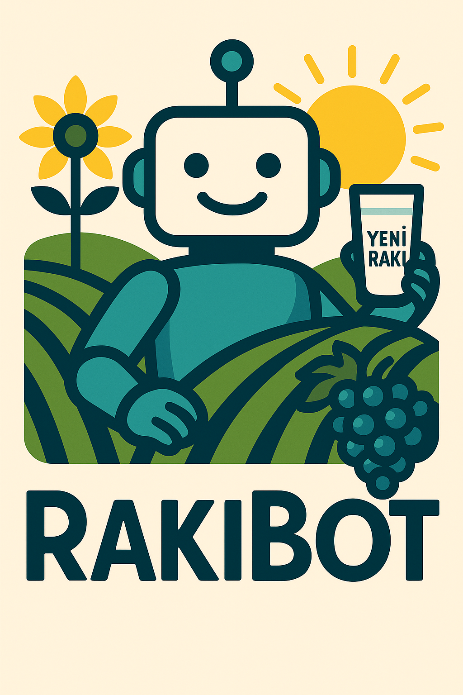

<div align="center">



</div>

# RakıBot AI Assistant

**RakıBot** is an advanced conversational AI assistant designed to provide intelligent responses using dual conversation modes. Originally developed as an AGH RAG Chat Bot for university regulation queries, it has evolved into a sophisticated multi-modal chatbot with enhanced linguistic capabilities and web search integration.

## Features

**Dual AI System Architecture:**
- **Normal Mode:** Google Gemma 3 (via Ollama) with enhanced web search capabilities
- **AGH Mode:** Document-based RAG (Retrieval-Augmented Generation) system for academic regulations

**Advanced Language Support:**
- **Trakya Dialect:** Authentic Thracian Turkish dialect with cultural context
- **Standard Turkish:** Professional Turkish language responses
- **English Support:** Comprehensive English language capabilities

**Technical Capabilities:**
- Real-time conversation memory management
- Intelligent web search integration with content extraction
- Vector-based document embedding and retrieval
- Advanced profanity handling with context awareness
- Responsive web interface with modern UI design
- Multi-API failover system for enhanced reliability

**Specialized Features:**
- AGH University regulation expert system
- Geographic query detection with automatic web search
- Context-aware response generation
- Source citation and trust scoring
- Conversation style adaptation based on user preferences

## Quick Start

### Prerequisites

- Python 3.9+
- Ollama with Gemma 3 model installed
- Modern web browser

### Local Installation

1. **Clone the repository**
   ```bash
   git clone https://github.com/OguzhanBerkeOzdil/RakiBot.git
   cd RakiBot
   ```

2. **Install dependencies**
   ```bash
   pip install -r requirements.txt
   ```

3. **Configure environment**
   
   Copy configuration templates and fill in your credentials:
   ```bash
   cp credentials.json.example credentials.json
   cp .env.example .env
   # Edit both files with your actual API keys and settings
   ```

4. **Start the application**
   ```bash
   python run.py
   ```

5. **Access the interface**
   Open your browser to `http://127.0.0.1:5000`

### Docker Deployment

```bash
# Build the container
docker build -t rakibot .

# Run the container
docker run -p 5000:5000 rakibot
```

## Project History

**Initial Development (AGH RAG Chat Bot):**
This project was initially developed as a simple RAG chatbot for AGH University of Science and Technology Krakow by Oğuzhan Berke Özdil and Berkay Doruk for the "Knowledge Representation and Knowledge Engineering" laboratory course (M.Sc. AI & Data Analysis, 1st year). The original system was a basic document-based Q&A bot that provided pre-defined answers to specific AGH regulation queries using simple document retrieval.

**Advanced Development (RakıBot):**
Subsequently, Oğuzhan Berke Özdil extensively redesigned and enhanced the system, transforming it into an intelligent conversational AI. The evolution included:
- Integration with Google Gemma 3 LLM for advanced natural language processing
- Implementation of real-time web search capabilities for dynamic information retrieval
- Development of dual conversation modes with Trakya dialect support (reflecting the developer's regional background)
- Addition of sophisticated conversation memory and context awareness
- Complete architectural overhaul from simple Q&A to intelligent chatbot

## Contributors

- **Oğuzhan Berke Özdil** - Lead Developer & Project Architect ([LinkedIn](https://www.linkedin.com/in/oguzhanberkeozdil/))
- **Berkay Doruk** - Initial AGH RAG Implementation (original version)

## Important Files

**Configuration Templates:**
- `credentials.json.example` - Google Service Account template
- `.env.example` - Environment variables and API keys template

**Excluded from Repository:**
- `credentials.json` - Contains sensitive Google Service Account keys
- `.env` - Contains API keys and environment configuration
- `app.log` - Application log files
- `agh_embedding_cache.npy` - Generated embedding cache
- `web_cache/` - Web search cache directory
- `__pycache__/` - Python bytecode cache

## Content Policy

This system includes contextual profanity handling and tolerates mild off-language expressions while maintaining strict policies against hateful or harassing content generation.

## License

This project is licensed under the MIT License - see the [LICENSE](LICENSE) file for details.
